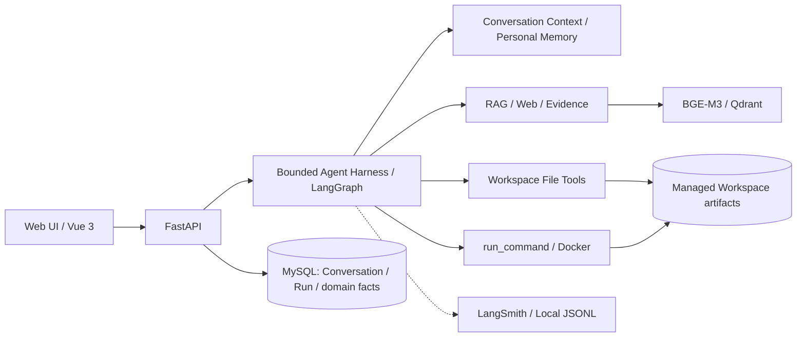

# Langley

> Web-first Personal Knowledge & Execution Agent

Langley 是面向个人的知识与执行 Agent：在 Web 中结合带来源证据的 RAG、会话与个人上下文、托管 Workspace，以及有边界的文件操作和 Docker 命令执行。

用户既可以围绕自己的资料持续提问，也可以导入一个项目副本，让 Agent 读取文件、执行测试、观察失败并修改产物。Workspace / Sandbox v0 已完成空项目执行、Python 项目修复、timeout aftermath 和文件夹导入的人工 smoke 验收。

## 核心能力

| 层次 | 当前能力 |
| --- | --- |
| **Think** | Conversation Context 与跨会话 Personal Context Memory；用户可查看、修改、遗忘或关闭自动记忆。 |
| **Know** | BGE-M3 / Qdrant 知识检索、Web 搜索与正文读取、受验证的 evidence / citations。 |
| **Act** | New Workspace、Import Folder（managed copy）、五个文件/命令 Tools、Docker Sandbox、文件预览与 Run change summary。 |
| **Observe / Evaluate** | 有预算和权限边界的 Agent Harness、LangSmith metadata tracing、本地 Run diagnostics，以及检索/回答质量 Eval。 |

## Skill Runtime v0

AUTO execution 支持 builtin 与本地安装的 user Skill：两种来源进入同一个
Registry / execution snapshot / catalog / `load_skill` / reference reader。
Skill 是独立的 procedure axis；没有 KB 也可以使用，且不会因此获得 Knowledge、
Web 或 Workspace capability。REQUIRED 继续走确定性 KB QA，不进入 Skill AUTO graph。

从仓库根目录配置并安装本地包：

```powershell
$env:LANGLEY_BUILTIN_SKILL_ROOT = 'G:\LangleySkills\builtin'
$env:LANGLEY_SKILL_STORAGE_ROOT = 'G:\LangleySkills\installed'
uv run --locked python -m langley.skill_installation 'G:\Downloads\example-skill'
```

默认 builtin root 为 `skills/builtin`，storage root 为 `data/skills`；两者以及
Workspace storage 必须互不包含。应用与安装命令使用相同配置。每个包目录名必须与
SKILL.md frontmatter 中的 name 完全一致；name 为最多 64 字符的小写字母、数字和内部
单连字符，description 为最多 1024 字符的非空字符串。仓库不预装业务 Skill。

安装会将输入目录有界复制到私有 staging，验证后原子发布到
`<storage-root>/user/<name>`。该受控目录是安装事实；不写 Skill DB 表。
完整包限制为 256 个文件、512 个遍历条目、4 MiB/文件、8 MiB 总量，SKILL.md 上限
64 KiB；拒绝路径逃逸、symlink/junction、hardlink 和特殊文件。每个 source 最多发现
64 个 Skill；builtin/user 名称全局唯一，不覆盖同名包。

安装只在名称/数量检查和 rename 期间持有本地 OS 文件锁，避免并发安装越过上限；
复制和验证在锁外。锁文件在 user root 之外，不记录安装状态，进程关闭时由 OS 释放锁。

Builtin 在应用装配时发现；新 AUTO execution 扫描已发布 user root，冻结自己的
SkillSnapshot。因此安装后无需重启即可供新 execution 发现，已有 execution 不会中途
获得新 Skill。load 时重验 SKILL.md SHA；激活后必须重新规划，最多一个 active Skill。
正文只叠加在当前 capability-aware instructions 上，不授予 Tool 或 Sandbox 权限。

仅 `references/` 是 Runtime resource：激活时冻结 path/byte-size/hash manifest，
按需读取时验证字节身份，内容作为 data 返回。限制为 64 文件、256 KiB/文件、2 MiB
总量、256 遍历条目，单次 JSON observation 最多 16 KiB。文本模板应放入 references；
`templates/` 不再是 Runtime 分类。scripts/assets 可作为有界包文件保存，但不执行或渲染。

这是本地操作者入口，没有 Agent 安装 Tool、HTTP 管理 API、update/uninstall、GC 或
watcher。published root 必须由应用控制，不放进模型可写 Workspace；不能防御拥有相同
宿主文件权限的恶意进程。发布保证完整目录的原子可见性，不承诺断电持久性；staging
cleanup 失败不改变安装结果，可能保留不可发现的临时目录。旧 `packages/<uuid>/...`
不会自动导入新 user root。

## 技术架构



MySQL 保存持久化业务事实，Qdrant 是可重建的检索索引，Workspace 文件保存产物。LangGraph、SSE 和 diagnostics 用于执行或观察，不替代业务状态。

## 一个执行闭环

导入含 bug 的 Python 项目副本后，提出“运行测试并修复失败”：

```text
User task → pytest fails → Agent inspects current Workspace
          → exact file edit → pytest rerun passes
```

Agent 使用 `list_files`、`read_file`、`write_file`、`edit_file` 和 `run_command`。
写入和命令调用后必须先观察结果，再规划下一步；用户可查看文件和成功 Run 的 change summary。导入后的修改只作用于 managed copy，原始文件夹不受影响。

**Model input is intent, not authority.** Harness 验证 Tool 名称、严格参数、用户权限与 Workspace scope；模型不能指定 host path、Docker mount 或容器策略。副作用 Tool 没有透明自动 retry；失败或取消不回滚文件，Retry 创建新 Run 并从当前 Workspace 重新规划。

## Persistent Workspace / Disposable Compute

容器按 Run lazy-create，同一 Run 的命令通常复用容器及 `/tmp` 等容器文件状态。每次命令使用新的 `bash -lc`，不继承 shell-local 的 cwd/export/alias/function；timeout/reset 销毁当前容器，下一次命令再创建 fresh compute。`/workspace` 产物跨容器 reset 和 Runs 保留。

Docker 使用离线 Linux、非 root、只读 rootfs、临时 `/tmp`、移除 capabilities，并限制 CPU、内存、PID、timeout 和输出；只挂载当前 managed Workspace，不挂载 Docker socket、后端凭据或 host home。它提供模型生成代码的 **fault containment**，不提供 hostile multi-tenant VM 级安全保证。构建与详细边界见 [Sandbox 使用说明](sandbox/README.md)。

## Eval 与可靠性

确定性测试验证路径边界、scope、预算、文件修改与失败后的状态；真实 MySQL/Docker 验证存储和执行语义；模型质量通过 Eval 与人工 smoke 单独评估，FakeProvider 测试不作为质量证明。

LangSmith 内容导出独立配置。本地 diagnostics 通过已有 tracing seam 按 Run 追加 JSONL；development 默认记录完整请求、Tool 参数和结果，可独立关闭，写入失败不影响 Run。它不承担 audit、checkpoint 或恢复职责，详情见 [诊断配置](sandbox/README.md#local-run-diagnostics)。

## 技术栈

* Backend：FastAPI / MySQL
* Agent：LangGraph / Qwen
* Retrieval：BGE-M3 / Qdrant
* Execution：Docker / Linux / Python / pytest
* Observability：LangSmith / Local JSONL / Structured Logging
* Frontend：Vue 3 / Vite / TypeScript

## Quick Start

需要 Python 3.12、[uv](https://docs.astral.sh/uv/)、Node.js 24、npm 和 Docker Desktop。

### 1. 启动 MySQL 与 Qdrant

```powershell
docker compose up -d mysql qdrant
docker compose ps
```

### 2. 配置环境变量

在启动后端的 shell 中按本机配置设置以下变量，连接信息和凭据留在本地：

| 变量 | 用途 |
| --- | --- |
| `LANGLEY_DATABASE_URL` | 自己配置的 MySQL 应用数据库连接 |
| `LANGLEY_LOCAL_USER_ID` | 本地用户 ID |
| `LANGLEY_QWEN_API_KEY` | 自己的模型服务凭据 |
| `LANGLEY_QWEN_BASE_URL` | 服务商提供的兼容 endpoint |

更多配置见 [`.env.example`](.env.example)。

### 3. 初始化后端

```powershell
uv sync --locked --group retrieval
uv run alembic upgrade head
uv run python -m langley.bootstrap
docker build -t langley-sandbox:v0 sandbox
```

### 4. 启动服务

```powershell
uv run uvicorn langley.main:create_app --factory --reload
```

另开一个 PowerShell 窗口：

```powershell
Set-Location frontend
npm ci
npm run dev -- --host 127.0.0.1
```

打开 Vite 输出的地址即可使用 Langley。

## 当前边界

- Local-first、单用户、单后端进程；Workspace 是托管副本，尚无 Git-backed / attached Workspace 或 stateful terminal。
- 没有磁盘配额、容器 orphan 自动回收或 MySQL/文件系统跨资源原子提交；未知 commit outcome 时保留文件，可能留下无引用目录。
- change summary 为有界、进程内数据；Developer Mode、完整前端 diff UX、durable change journal、失败/取消 summary 尚未实现。
- Study Skills、Checkpointer/HITL、进一步 Agentic RAG 优化、PDF/OCR 能力扩展仍待后续证据与独立验收。
